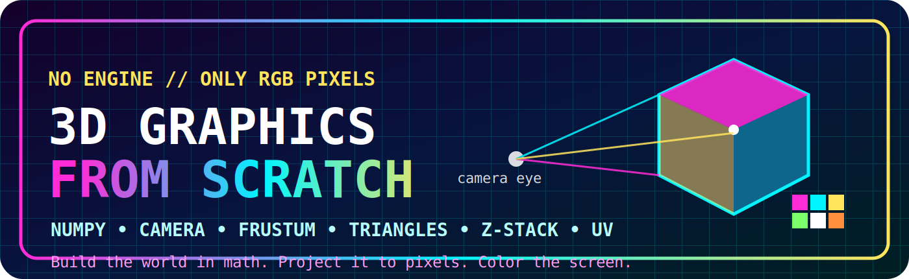
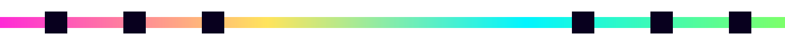
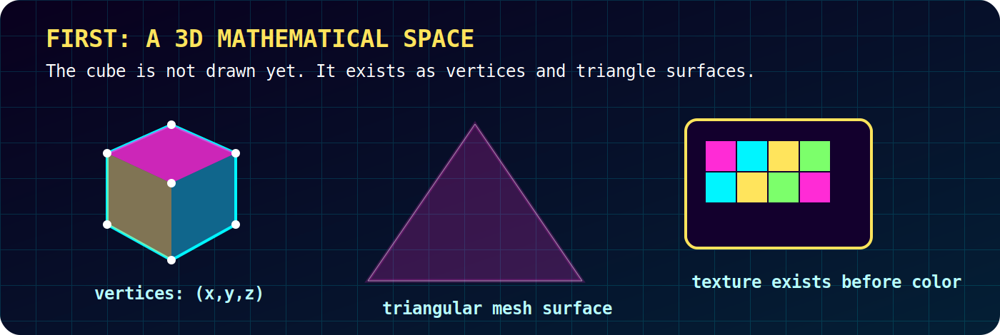
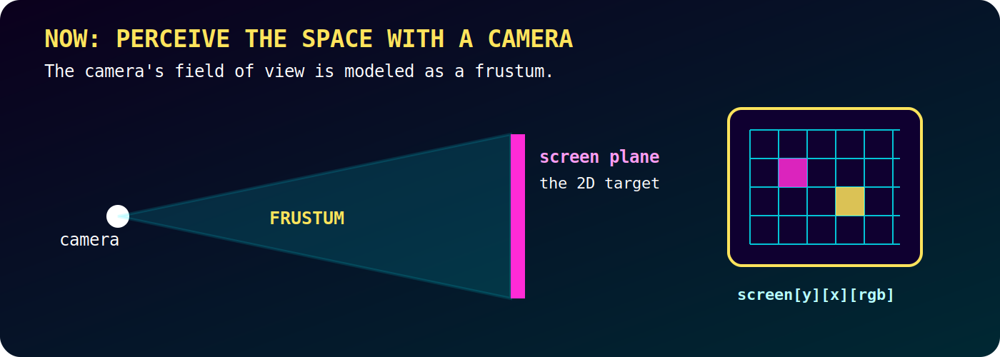
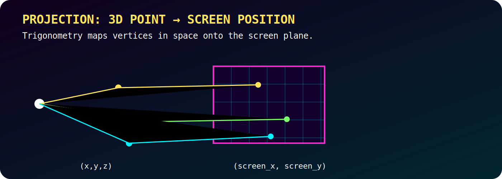
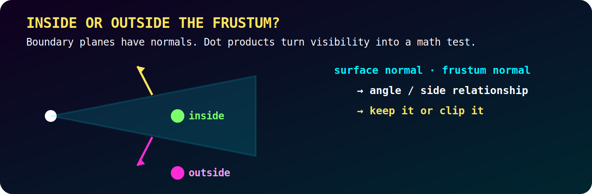
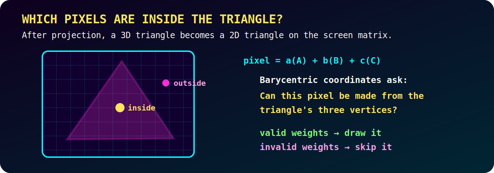
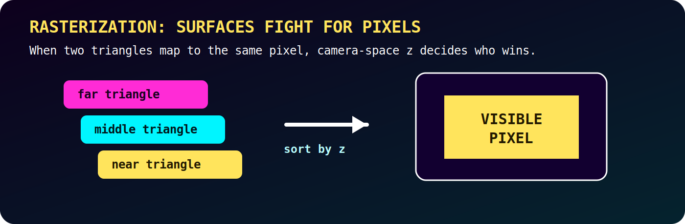
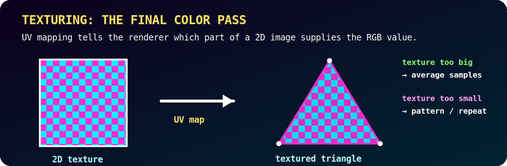

<p align="center">
  
</p>

<p align="center">
  <a href="https://github.com/EmperorCodeman/3d_graphics_from_scratch"><b>Public Repository</b></a>
  · <b>10-2022</b>
  · <b>NumPy</b> · <b>3D Math</b> · <b>Camera</b> · <b>Frustum</b> · <b>Rasterization</b>
</p>

<p align="center">
  
</p>

# 3D Graphics from Scratch

## The game rule

**No graphics engine. No OpenGL. No framework call that says, “draw me a cube.”**

The program gets one weapon:

> choose the RGB value of every pixel on the screen.

With that rule, this repository builds a 3D renderer from math: a cube in 3D space, a movable camera, a frustum field of view, projection onto a screen matrix, rasterization, z-depth sorting, and texture mapping.

---

## Table of Contents

- [Level 01 - 3D space before pixels](#level-01---3d-space-before-pixels)
- [Level 02 - The camera and the frustum](#level-02---the-camera-and-the-frustum)
- [Level 03 - The screen as a matrix](#level-03---the-screen-as-a-matrix)
- [Level 04 - Projection onto the screen](#level-04---projection-onto-the-screen)
- [Level 05 - Inside or outside the frustum](#level-05---inside-or-outside-the-frustum)
- [Level 06 - Barycentric triangle fill](#level-06---barycentric-triangle-fill)
- [Level 07 - Rasterization and the Z-stack](#level-07---rasterization-and-the-z-stack)
- [Level 08 - Texture mapping](#level-08---texture-mapping)
- [Final Result](#final-result)

<p align="center">
  
</p>

---

## Level 01 - 3D space before pixels

<details>
<summary><b>Vocabulary</b></summary>

| Term | Meaning |
|---|---|
| **Vertex** | A point in 3D space, usually written as `(x, y, z)`. |
| **Triangle mesh** | A 3D model built from triangle surfaces. |
| **Texture** | A 2D image or color pattern attached to a surface. |
| **Scene** | The collection of objects the camera can see. |

</details>

First we start with a 3D mathematical space.

At this stage, there is no screen and no depth perception. There are only models made out of points and triangles. A cube is not a magic box. It is vertices connected into triangular surfaces, and those surfaces can carry texture coordinates.

```text
cube
  -> vertices: (x, y, z)
  -> triangle faces
  -> texture coordinates
```

Now the problem becomes: how does a camera perceive that 3D scene as a 2D image?

---

## Level 02 - The camera and the frustum

<details>
<summary><b>Vocabulary</b></summary>

| Term | Meaning |
|---|---|
| **Camera** | The movable viewpoint inside the 3D scene. |
| **Frustum** | The camera's field of view, shaped like a cut-off pyramid. |
| **Screen plane** | The flat plane inside the frustum where the scene is projected. |
| **Field of view** | The region of space the camera can perceive. |

</details>

I created a virtual camera in 3D space which can be moved around and rotated.

From this camera, perception of the scene arises through a **frustum**: a pyramid representing the field of view, except the top of the pyramid is a plane, the screen, not a sharp point.

<p align="center">
  
</p>

The frustum answers the first big visual question:

```text
Can the camera see this part of the 3D world?
```

If an object is outside the frustum, it does not belong on the screen.

---

## Level 03 - The screen as a matrix

<details>
<summary><b>Vocabulary</b></summary>

| Term | Meaning |
|---|---|
| **Pixel** | One colored position on the screen. |
| **RGB** | The red, green, and blue values that define a pixel's color. |
| **Screen buffer** | The array that stores the final pixel colors. |

</details>

The screen plane of the frustum becomes the pixel grid.

At first, think of the screen as a 2D matrix:

```text
screen[y][x]
```

Each position maps to one pixel. But a pixel also needs color, so the actual buffer is better understood as:

```text
screen[y][x][rgb]
```

For example:

```text
1080 x 1920 x 3
```

The final `3` stores the red, green, and blue channels. The entire renderer exists to fill this matrix correctly.

---

## Level 04 - Projection onto the screen

<details>
<summary><b>Vocabulary</b></summary>

| Term | Meaning |
|---|---|
| **Projection** | Mapping a 3D point onto the 2D screen plane. |
| **Screen coordinate** | The `(x, y)` position where a 3D vertex lands on the screen. |
| **Perspective** | The visual effect where depth changes how large or small things appear. |

</details>

Once a 3D model exists and the camera has a frustum, the vertices need to be projected onto the screen plane.

A 3D vertex begins as:

```text
(x, y, z)
```

After projection, it becomes:

```text
(screen_x, screen_y)
```

<p align="center">
  
</p>

This is done with trigonometry. The camera looks through the frustum, and the math determines where each vertex lands on the screen.

These projected points are usually decimal values first. The renderer then has to translate them into discrete pixel positions.

---

## Level 05 - Inside or outside the frustum

<details>
<summary><b>Vocabulary</b></summary>

| Term | Meaning |
|---|---|
| **Normal vector** | A vector perpendicular to a surface or plane. |
| **Dot product** | A vector operation that measures directional relationship. |
| **Clipping** | Removing geometry outside the visible region. |

</details>

The vertices of a triangular mesh are either inside the frustum or not.

The frustum has boundary planes. Those planes have normal vectors. By comparing a surface or vertex direction against the frustum normals with the dot product, the program can decide what belongs inside the camera's visible volume.

<p align="center">
  
</p>

Conceptually:

```text
surface normal · frustum normal
  -> angle relationship
  -> inside / outside decision
```

After clipping, the renderer keeps the geometry the camera can actually see.

---

## Level 06 - Barycentric triangle fill

<details>
<summary><b>Vocabulary</b></summary>

| Term | Meaning |
|---|---|
| **Barycentric coordinates** | Weights that express a point as a combination of a triangle's three vertices. |
| **Triangle fill** | Determining which screen pixels are inside a projected triangle. |
| **Linear combination** | A weighted sum of points or vectors. |

</details>

After projection, a triangle has three points on the screen.

Now the renderer asks:

```text
Which pixels are inside this triangle?
```

I express pixels on the screen in terms of a linear combination of the surface's three vertices.

```text
pixel = a(vertex_1) + b(vertex_2) + c(vertex_3)
```

<p align="center">
  
</p>

Using geometric theory, the transformed coordinates tell whether the pixel is inside the surface. Now the renderer knows which surfaces are in the frustum and which pixels are within each surface.

---

## Level 07 - Rasterization and the Z-stack

<details>
<summary><b>Vocabulary</b></summary>

| Term | Meaning |
|---|---|
| **Rasterization** | Converting projected geometry into pixels. |
| **Z coordinate** | The depth value in camera space. |
| **Occlusion** | When one surface blocks another. |
| **Z-stack** | My stack-based method for sorting competing pixel calls by depth. |

</details>

A conflict arises when two surfaces overlap the same pixels.

Simple: create a stack of screens. Each time you get a pixel call, put it into the stack. The z-coordinate in camera space is then used to sort the stacks.

<p align="center">
  
</p>

Then all but the visible layer is discarded.

Leaving the screen.

---

## Level 08 - Texture mapping

<details>
<summary><b>Vocabulary</b></summary>

| Term | Meaning |
|---|---|
| **UV mapping** | Mapping a 2D texture image onto a 3D surface. |
| **Texture sampling** | Reading color from the texture. |
| **Averaging** | Combining texture samples when the texture is too large. |
| **Patterning** | Repeating or distributing samples when the texture is too small. |

</details>

One last note on texturing.

The linear combination of primary colors used to display the pixel is calculated in the program using UV mapping.

<p align="center">
  
</p>

Once the surface is projected onto 2D discrete pixel coordinate space, the texture is applied using averaging when the texture is too big, or patterning when the texture is too small.

That is how the renderer turns geometry into colored surface detail.

---

## Final Result

This repository builds the rendering path from 3D math to final RGB pixels:

```text
3D space
  -> triangular mesh cube
    -> movable camera
      -> frustum field of view
        -> screen matrix
          -> trig projection
            -> dot product clipping
              -> barycentric triangle fill
                -> rasterization + z-stack
                  -> UV texture mapping
                    -> final RGB image
```

The final scene can contain a cube, a rotating cube, a textured cube, a movable camera, changing depth perception, and multiple cubes in the same 3D space.

**Public Repository:** https://github.com/EmperorCodeman/3d_graphics_from_scratch

<p align="center">
  
</p>
